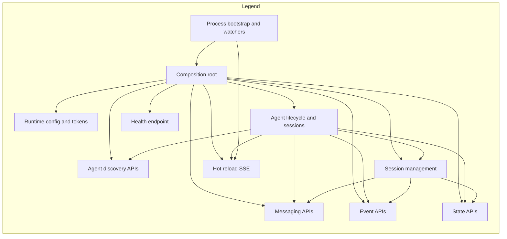

# ADK CLI HTTP Layer Architecture

This document maps the responsibilities and interactions of the HTTP layer located at [packages/adk-cli/src/http](packages/adk-cli/src/http).

## High-level overview

- Composition root: [http.module.ts](packages/adk-cli/src/http/http.module.ts) wires all feature modules.
- Bootstrap: [startHttpServer()](packages/adk-cli/src/http/bootstrap.ts:187) creates and configures the NestExpress application, scans agents, and initializes hot reload.
- Runtime configuration: [runtime-config.ts](packages/adk-cli/src/http/runtime-config.ts) defines the shape of configuration provided via [ConfigModule.register()](packages/adk-cli/src/http/config/config.module.ts:8).
- Core providers: agent discovery, loading, and lifecycle are centralized in [providers/](packages/adk-cli/src/http/providers).
- Feature areas: discovery, messaging, sessions, events, state, reload, and health each provide focused controllers and services.

## Module composition

- [HttpModule.register()](packages/adk-cli/src/http/http.module.ts:15) imports:
  - [ConfigModule](packages/adk-cli/src/http/config/config.module.ts)
  - [ProvidersModule](packages/adk-cli/src/http/providers/providers.module.ts)
  - [DiscoveryModule](packages/adk-cli/src/http/discovery/discovery.module.ts)
  - [MessagingModule](packages/adk-cli/src/http/messaging/messaging.module.ts)
  - [SessionsModule](packages/adk-cli/src/http/sessions/sessions.module.ts)
  - [EventsModule](packages/adk-cli/src/http/events/events.module.ts)
  - [StateModule](packages/adk-cli/src/http/state/state.module.ts)
  - [ReloadModule](packages/adk-cli/src/http/reload/reload.module.ts)
  - [HealthModule](packages/adk-cli/src/http/health/health.module.ts)

---

## Folder responsibilities

### config/
Purpose:
- Provide runtime configuration and DI tokens to the entire HTTP layer.

Key pieces:
- [ConfigModule.register()](packages/adk-cli/src/http/config/config.module.ts:8) exposes:
  - [RUNTIME_CONFIG](packages/adk-cli/src/http/runtime-config.ts) value
  - Agents directory token (from TOKENS.AGENTS_DIR)
  - Quiet flag token (from TOKENS.QUIET)

### providers/
Purpose:
- Core infrastructure for agent lifecycle: scanning, loading, running, and session plumbing.

Key services:
- [AgentScanner](packages/adk-cli/src/http/providers/agent-scanner.service.ts) recursively discovers agent folders by locating agent.ts or agent.js files.
  - [scanAgents()](packages/adk-cli/src/http/providers/agent-scanner.service.ts:29) returns a Map of discovered agents with names and paths.
- [AgentLoader](packages/adk-cli/src/http/providers/agent-loader.service.ts) loads agent modules and resolves diverse export patterns.
  - [importTypeScriptFile()](packages/adk-cli/src/http/providers/agent-loader.service.ts:22) compiles TypeScript agents on the fly via esbuild with safe externalization.
  - [loadEnvironmentVariables()](packages/adk-cli/src/http/providers/agent-loader.service.ts:167) preloads env files in priority order without overriding existing process env.
  - [resolveAgentExport()](packages/adk-cli/src/http/providers/agent-loader.service.ts:366) robustly resolves BaseAgent from many export styles.
- [AgentManager](packages/adk-cli/src/http/providers/agent-manager.service.ts) orchestrates scanning, booting, messaging, and stop-all semantics.
  - [scanAgents()](packages/adk-cli/src/http/providers/agent-manager.service.ts:42) populates the in-memory agents registry.
  - [startAgent()](packages/adk-cli/src/http/providers/agent-manager.service.ts:48) dynamically loads and boots an agent, creating a session via AgentBuilder.withSessionService.
  - [sendMessageToAgent()](packages/adk-cli/src/http/providers/agent-manager.service.ts:173) streams a message to the agent runner and aggregates text output.
  - stop semantics: [stopAgent()](packages/adk-cli/src/http/providers/agent-manager.service.ts:164), [stopAllAgents()](packages/adk-cli/src/http/providers/agent-manager.service.ts:226).

Also provided:
- In-memory session storage via [InMemorySessionService](packages/adk-cli/src/http/providers/providers.module.ts) binding from @iqai/adk.

### discovery/
Purpose:
- List available agents and trigger re-scan.

HTTP surface:
- [AgentsController](packages/adk-cli/src/http/discovery/agents.controller.ts) exposes:
  - GET /api/agents &#x2d;> list discovered agents
  - POST /api/agents/refresh &#x2d;> rescan current working directory and return updated list

### messaging/
Purpose:
- Read messages for the active session and send new user messages with optional attachments.

Components:
- [MessagingController](packages/adk-cli/src/http/messaging/messaging.controller.ts) routes:
  - GET /api/agents/:id/messages
  - POST /api/agents/:id/message
- [MessagingService](packages/adk-cli/src/http/messaging/messaging.service.ts) delegations:
  - [getMessages()](packages/adk-cli/src/http/messaging/messaging.service.ts:18) pulls messages from the current session via SessionsService.
  - [postMessage()](packages/adk-cli/src/http/messaging/messaging.service.ts:27) uses AgentManager to run the message through the agent and return response text.

### sessions/
Purpose:
- Manage agent sessions: list, create, delete, switch, and translate raw session data into API responses.

Components:
- [SessionsController](packages/adk-cli/src/http/sessions/sessions.controller.ts) routes:
  - GET /api/agents/:id/sessions
  - POST /api/agents/:id/sessions
  - DELETE /api/agents/:id/sessions/:sessionId
  - POST /api/agents/:id/sessions/:sessionId/switch
- [SessionsService](packages/adk-cli/src/http/sessions/sessions.service.ts):
  - [ensureAgentLoaded()](packages/adk-cli/src/http/sessions/sessions.service.ts:29) centralizes lazy boot of agents before performing any operation.
  - [getAgentSessions()](packages/adk-cli/src/http/sessions/sessions.service.ts:124) returns normalized session metadata.
  - [createAgentSession()](packages/adk-cli/src/http/sessions/sessions.service.ts:179) creates or upserts sessions with optional initial state.
  - [deleteAgentSession()](packages/adk-cli/src/http/sessions/sessions.service.ts:228) deletes a session.
  - [switchAgentSession()](packages/adk-cli/src/http/sessions/sessions.service.ts:303) changes the loaded agent’s active sessionId.
  - [getSessionMessages()](packages/adk-cli/src/http/sessions/sessions.service.ts:81) converts session events to user or assistant messages.
  - [getSessionEvents()](packages/adk-cli/src/http/sessions/sessions.service.ts:247) returns event stream snapshot including function calls and responses.
  - [getSessionState()](packages/adk-cli/src/http/sessions/sessions.service.ts:330) aggregates agent, user, and session state into a single response.
  - [updateSessionState()](packages/adk-cli/src/http/sessions/sessions.service.ts:412) updates nested session state values via dot-paths.

### events/
Purpose:
- Fetch event history for a specific session.

Components:
- [EventsController](packages/adk-cli/src/http/events/events.controller.ts) route:
  - GET /api/agents/:id/sessions/:sessionId/events
- [EventsService](packages/adk-cli/src/http/events/events.service.ts):
  - [getEvents()](packages/adk-cli/src/http/events/events.service.ts:11) delegates to SessionsService to retrieve normalized events.

### state/
Purpose:
- Read and mutate session-scoped state with minimal API.

Components:
- [StateController](packages/adk-cli/src/http/state/state.controller.ts) routes:
  - GET /api/agents/:id/sessions/:sessionId/state
  - PUT /api/agents/:id/sessions/:sessionId/state
- [StateService](packages/adk-cli/src/http/state/state.service.ts):
  - [getState()](packages/adk-cli/src/http/state/state.service.ts:11) returns agentState, userState, sessionState, and metadata.
  - [updateState()](packages/adk-cli/src/http/state/state.service.ts:29) writes nested state via SessionsService.

### reload/
Purpose:
- Server-sent events for hot-reload notifications and server-side file watching integration.

Components:
- [ReloadController](packages/adk-cli/src/http/reload/reload.controller.ts) route:
  - GET /reload/stream &#x2d;> SSE connection for web clients.
- [HotReloadService](packages/adk-cli/src/http/reload/hot-reload.service.ts):
  - Manages SSE clients and keepalive.
  - [broadcast()](packages/adk-cli/src/http/reload/hot-reload.service.ts:62) sends reload events with filename and timestamp.
- Bootstrap integration in [bootstrap.ts](packages/adk-cli/src/http/bootstrap.ts):
  - File watching and debounced reload are set up in internal helper setupHotReload.
  - Skips common build dirs and honors simple .gitignore path prefixes.

### health/
Purpose:
- Basic liveness probe.

Endpoint:
- [HealthController.health()](packages/adk-cli/src/http/health/health.controller.ts:5) &#x2d;> GET /health

---

## Bootstrap and runtime wiring

- [startHttpServer()](packages/adk-cli/src/http/bootstrap.ts:187):
  - Creates Nest app with [HttpModule.register()](packages/adk-cli/src/http/http.module.ts:15).
  - Enables permissive CORS for development parity.
  - Triggers initial [AgentManager.scanAgents()](packages/adk-cli/src/http/providers/agent-manager.service.ts:42).
  - Configures hot reload watchers that clear and rescan agents, then [HotReloadService.broadcast()](packages/adk-cli/src/http/reload/hot-reload.service.ts:62).
- [RuntimeConfig](packages/adk-cli/src/http/runtime-config.ts) fields:
  - host, port: server bind target
  - agentsDir: root directory to scan
  - quiet: reduce logging verbosity
  - hotReload?: enable or disable watchers
  - watchPaths?: additional directories to watch

---

## Mermaid diagram

---

## API surface summary

- GET /health
- GET /api/agents
- POST /api/agents/refresh
- GET /api/agents/:id/messages
- POST /api/agents/:id/message
- GET /api/agents/:id/sessions
- POST /api/agents/:id/sessions
- DELETE /api/agents/:id/sessions/:sessionId
- POST /api/agents/:id/sessions/:sessionId/switch
- GET /api/agents/:id/sessions/:sessionId/events
- GET /api/agents/:id/sessions/:sessionId/state
- PUT /api/agents/:id/sessions/:sessionId/state
- GET /reload/stream

---

## Operational notes

- Hot reload filters file change events using a .gitignore-aware prefix list and skips common build and tooling directories to reduce noise.
- Agent sessions are persisted in-memory via @iqai/adk’s InMemorySessionService, and are keyed by appName and userId derived in [AgentManager.startAgent()](packages/adk-cli/src/http/providers/agent-manager.service.ts:48).
- Messaging streams aggregate chunked runner output into a simple response string for clients; for richer streaming, extend the messaging surface.
- All feature modules depend on ProvidersModule for consistent access to AgentManager and session services.